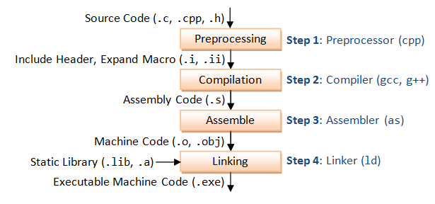

# const

## 作用

- 类型检查
- 防止修改
- 节省内存

## [Makefile](https://makefiletutorial.com/)



1. 预处理(pre-process):
   
   ```sh
   cpp hello.c > hello.i
   # 导入#include头文件
   # 导入#define宏定义
   ```
2. 编译(compile)

    ```sh
    gcc -S hello.i
    # 将预处理后文件编译成汇编程序
    ```
3. 汇编(assemble)

    ```sh
    as -o hello.o hello.s
    # 将汇编程序转换成目标文件，二进制格式
    # 每一个源文件修需要产生一个目标文件
    ```
4. 链接(link)

    ```sh
    ld -o hello hello.o ...
    # 将目标文件链接成可行程序
    ```

[A Simple Makefile Tutorial](https://cs.colby.edu/maxwell/courses/tutorials/maketutor/)

```Makefile
CC=gcc
CFLAGS=-I.
DEPS = hellomake.h
OBJ = hellomake.o hellofunc.o 

# $@ 指代 %.o 即:左边的内容
# $< 指代 $(DEPS)依赖列表的第一个项
%.o: %.c $(DEPS)
	$(CC) -c -o $@ $< $(CFLAGS)

# $^ 指代: 右边所有项
hellomake: $(OBJ)
	$(CC) -o $@ $^ $(CFLAGS)
```